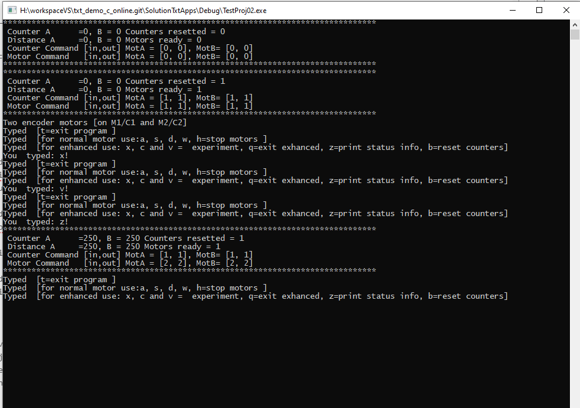
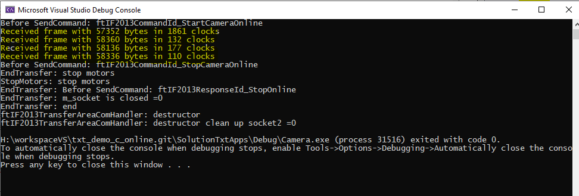
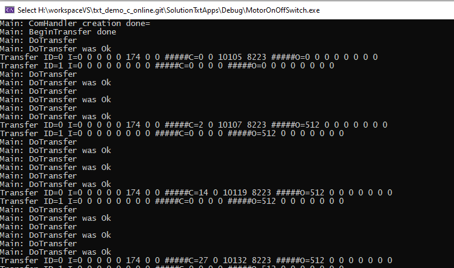

# Information about the use of the SolutionTxtApps.
This Visual Studio solution contains some examples about remote programming for the fischertechnik TXT controller. This with the use of the FtTxtLib.<br/>
THe FtTxtLib can be used as static or as dynamic (dll) library.<br/>
Switching between static and dynamic library is no too difficult.<br/>
This FtTxtLib has been extended with the communication thread. <br/>
With this approach, the structure that was in use with the TX-Controler and the Robo-Interface is similar now.


## Technical Information.
The examples has been compiled with MS-Visual Studio 2019 (v142).<br/>
Windows SDK version: 10.0.18362.0.<br/>
C++ language standard: ISO C++17 Standard (std:c++17).<br/>

.png)

### About the remote TXT API functionality

[See: remote TXT API user manual](./API-user-manual/0-Start-remote-TXT-API(FtTxtLib-FtTxtLibDll).md)
for the functionality of the ```fischertechnik::txt::remote::api::ftIF2013TransferAreaComHandlerEx2```. 

The project ```TestProj01```, ```Camera```, ```MotorOnOffSwitch``` and  ```TestProjIrControl```give examples of the use of the remote TXT API's. 


## Overview of the FtTxt library and the accompanying include files.
The FtTxt library files are present in the solution root directory ```FtLibs```. There is a ```Release``` and a ```Debug``` version.<br/>
.png)

If a application is using the DLL version, the FtTxtLibDll.dll needs to be present in the same directory as the application (```.exe```).<br/>
The accompanying include files are present in the solution root directory ```Includes```.<br/>
.png)

### How to incorporate these lib, dll and includes in your projects?
The ```FtTxtLib.h``` is multi funcional. The static library FtTxtLib.lib will be used if ```_LIB``` has been defined in C/C++ Preprocessor definition.<br/>
 .png)

 
The FtTxtLib.h needs to be included in the project and contains the next sections:<br/> 
``` C
#ifdef _LIB
#define  FtPro_API 
#else
#ifdef FTTXTLIB_EXPORTS
#define FtPro_API __declspec(dllexport)
#else
#define  FtPro_API __declspec(dllimport)
#endif
#endif
```

#### Add the Ft Txt includes to your project.<br/>
$(SolutionDir)Includes;<br/>
 .png)
 
#### Add the Ft Txt additional library path to your project.
 ```$(SolutionDir)FtLibs\$(Configuration)\``` $(Configuration) takes care for the Release or Debug version. <br/

.png)

#### Add the ```FtTxtLib.lib``` (static) or ```FtTxtLibDll.lib``` (DLL) to your project.<br/>  
.png)
  


## Overview of the example
Note: All project can used with static or dynamic link library.

### project ```TestProj02``` (static library)
Show the use of the communication thread and give some examples about testing the enhanced motor control functionality with keyboard commands.



### project ```Camera``` (dynamic link library)
Is the same as the original solution but now with the use of the ```FtTxtLib```.  
Save a stream of images to a directory.<br/>  
(no communication thread)



### project ```motorOnOffSwitch``` (dynamic link library)
Is the same as the original solution but now with the use of the ```FtTxtLib```.<br/>  
Show to use of an actuator and a sensor.<br/>  
(no communication thread)



# Document history
- (c) 2020-07-14 TesCaWeb.nl [C van Leeuwen] 466.1.1 new

